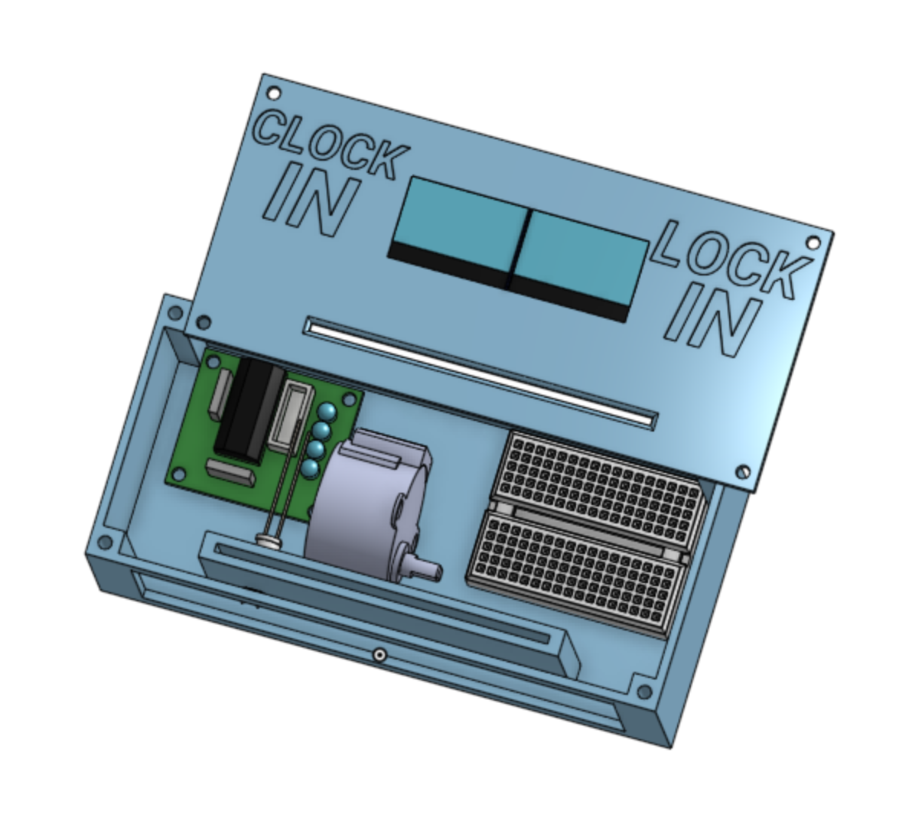

# Lock'n Clock'n

Hi! Welcome to my journal for my Lock'n Clock'n project!

# Devlog 1
1h 5m 4s Logged

I started the Lock'n Clock'n today! I cadded the case, the face, and the punch card. I think I'll just use index cards for those. I still don't know how I'll punch the cards,
but I'm sure that I'll figure it out. In the meantime, I also added some 3D models of the parts I'll be using, and I CADed screw holes and text. I'm excited to keep going!

# Devlog 2
1h 21min Logged

I CADed the system that will detect the position of the punch card in the Clock'n Lock'n. There will be an LED and a photoresistor, and the LED will constantly shine on the photoresistor. However, when the punch card is pushed through, the photoresistor will sense the light level drop. When a hole on the side of the punch card comes up, the light level will return to normal, and the Clock'n Lock'n will know the position of the punch card. I also started CADing the movement system. I plan to use a 28BYJ-48 Stepper Motor for percise control. I will need a second LED-photoresistor system to trigger it, or I will need to move the initial one up. We'll see which is more convenient for spacing. Yes, space management has been a real issue in this project. I wanted it to take up little space, so you could easily put it on your desk, but it seems I will have to make some comprimises. 

