# Lock'n Clock'n

Hi! Welcome to my journal for my Lock'n Clock'n project!

# Devlog 1
1h 5m 4s Logged

I started the Lock'n Clock'n today! I cadded the case, the face, and the punch card. I think I'll just use index cards for those. I still don't know how I'll punch the cards, but I'm sure that I'll figure it out. In the meantime, I also added some 3D models of the parts I'll be using, and I CADed screw holes and text. I'm excited to keep going!

# Devlog 2
1h 21min Logged

I CADed the system that will detect the position of the punch card in the Clock'n Lock'n. There will be an LED and a photoresistor, and the LED will constantly shine on the photoresistor. However, when the punch card is pushed through, the photoresistor will sense the light level drop. When a hole on the side of the punch card comes up, the light level will return to normal, and the Clock'n Lock'n will know the position of the punch card. I also started CADing the movement system. I plan to use a 28BYJ-48 Stepper Motor for percise control. I will need a second LED-photoresistor system to trigger it, or I will need to move the initial one up. We'll see which is more convenient for spacing. Yes, space management has been a real issue in this project. I wanted it to take up little space, so you could easily put it on your desk, but it seems I will have to make some comprimises. 

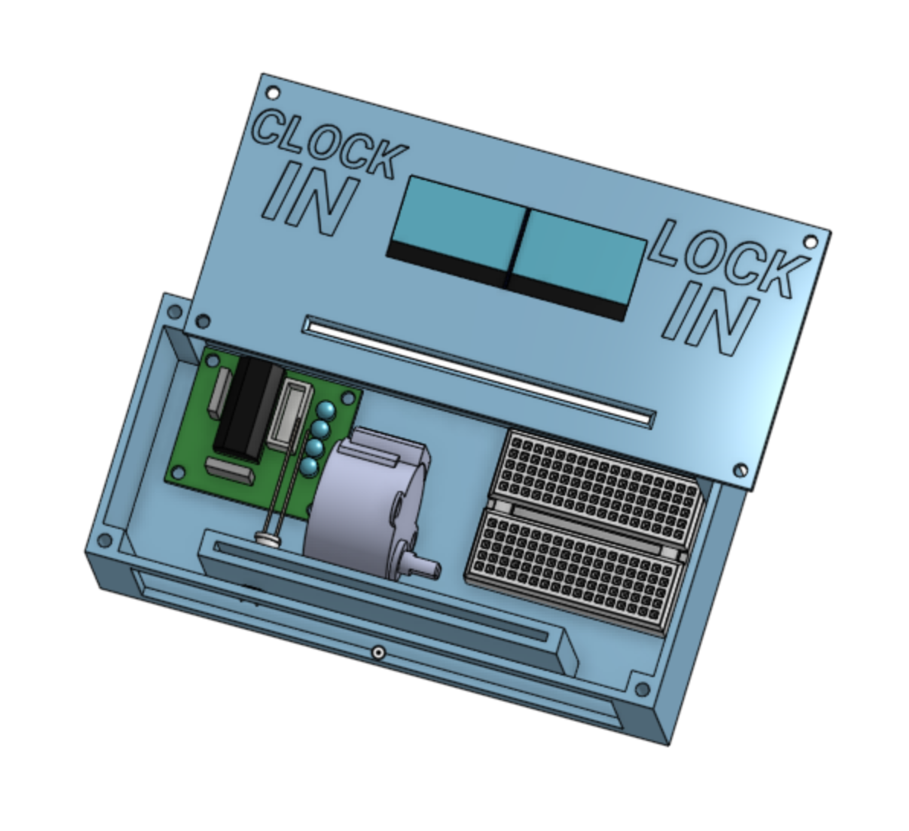

# Devlog 3
1h Logged

I CADed the Stepper mount and the wheel that will push the paper through the slot. Not a lot to say, just took a long time. 

# Devlog 4
1h 41min 28sec Logged

I coded and built the first prototype of the Clock'n Lock'n! I just had one position detection module and the movement module for now. The code was pretty simple, just a continuously spinning motor and a reading photoresistor. I think that I need a two-point axle for the movement module, as it was too flimsy and wouldn't hold in place. The position detection system worked well, as it gave a 32-unit difference between the punches. I need to make the case larger to fit an internal puncher and the movement module's second axle point. In the meantime, the test worked well!

# Devlog 5
1h 20min Logged

I got rid of the 28BYJ-48 Stepper motor and replaced it with a modified SG90 servo motor. I modified it by disconnecting the encoder and getting rid of the mechanical plastic catch, making it bacically a mini high-torque dc motor. I can control the speed, but I can't control the position anymore (due to the disconnected encoder). That's alright, as I can tell the position of the punch card anyway through the LED-photoresistor modules. Getting rid of the 28BYJ-48 in favor of the SG90 also has the benefit of saving space in the case, not only with the motor itself but also in the lack of a driver module. 

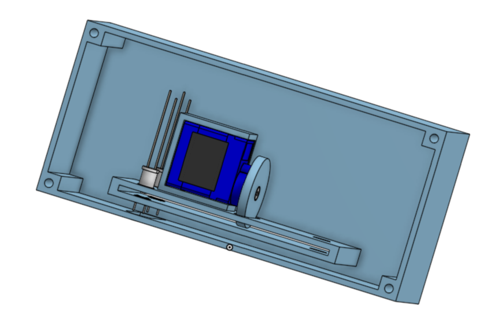

# Devlog 6
1h 10m 50sec Logged

I coded the test code and part of the actual code. I had to spend time coding the logic on the positioning, and I also had to do some soldering on the back of one of my OLEDs to change its adress. Again, not a lot to say, just a lot of difficult work, troubleshooting, but getting there in the end (:

# Devlog 7

42 min Logged

I built the first prototype of the Clock'n Lock'n! I couldn't figure out the stamping mechanism just yet, so I had to use a makeshift puncher consisting of a sharp chopstick, a bottle cap, and two pen springs. The new servo moving system works very well, though the position detection systems are not yet online. I need to make a hole puncher first. Overall, the tests that I set out to do with this prototype were all successes! I have new ideas on how to implement a stamp, like a solenoid (with a relay). 

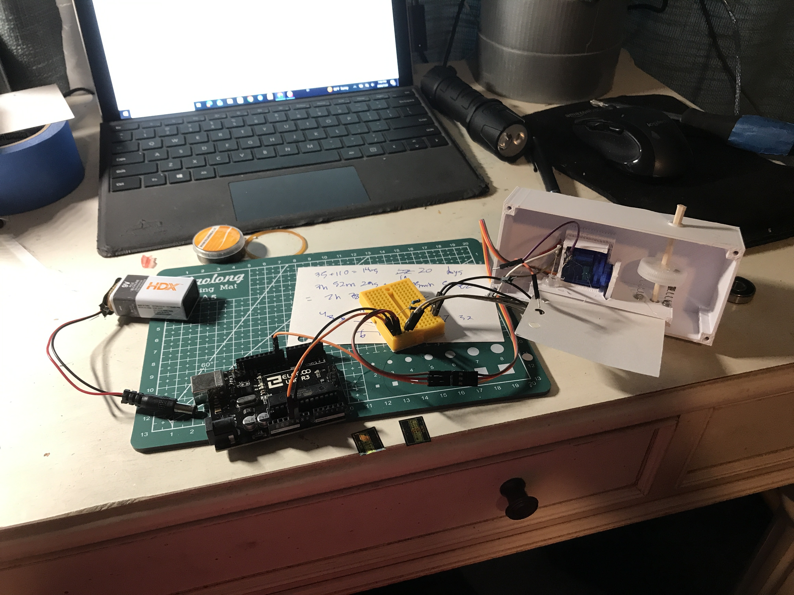

# Devlog 8
1h 32min Logged

I CADed a system to automatically punch holes in the paper! I did a lot of brainstorming, and I landed on a small pin with a rounded head that a cam would push onto. I modeled the bulk of it already, but I need to do some real-world testing before making any more decisions. I'm using a spring to hold the pin up, which is hard to model around. I also had to move the roof higher to fit the 28BYJ-48 stepper motor that I'm adding back, which sucks because I want to make this device as small as possible. Still, I'm telling myself that it was necessary, because the roof is now full of stuff and I can't put the buttons/LEDs that I was planning to add there. Instead, I'll have to add them onto the elongated face. 

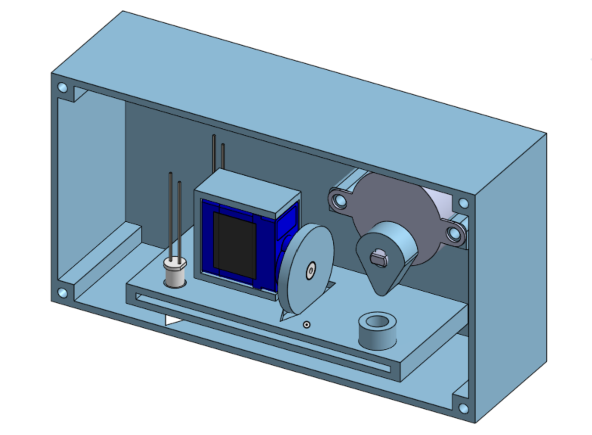

# Devlog 9
1h Logged

I CADed a test case (without walls) to test the punch system while saving time and filament. I also CADed the puncher that I'll use to punch the 10 pre-punched holes into the index card. A lot of work, not a lot of words. 

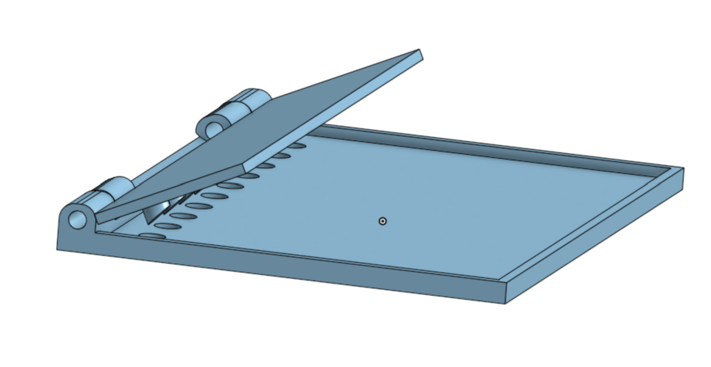
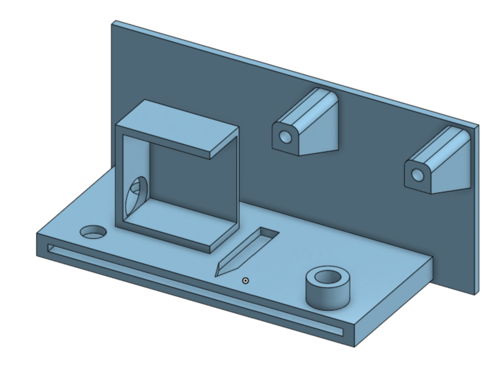

# Devlog 10
2h 17min Logged

Long working session! Lost track of time, I would have made seperate devlogs, but I'll just split this one into a software section and a hardware section. The software section goes first!

I coded the OLEDS into the Main file, and I coded the 28BYJ-48 Stepper Motor into both the Main file and the Test file. I coded some more logic into the Main file as well, like the paper positioning, the hole punching due to the hour count, etc. I was informed that each OLED screen will need 1024 bytes of RAM, but the Arduino Uno R3 only has 2000 available for the both of them. This means that I will need to work with a library that will lower the RAM usage in exchange for slower rendering times. I'm not worried about this, as the OLEDs' main function will be a clock and a progress bar. 

I printed out the testing case and attached the stepper motor with its cam gear. It seems that, while all dimensions are perfect in my model, the same can't be said in real life. Thankfully, I have prepared for this. I can fix the dimensioning problem by simply elongating the pin's length. However, I do need to fix the issue of the cam pushing the pin to its side instead of down. I will do this by modeling a wall for the pin to slide against. 

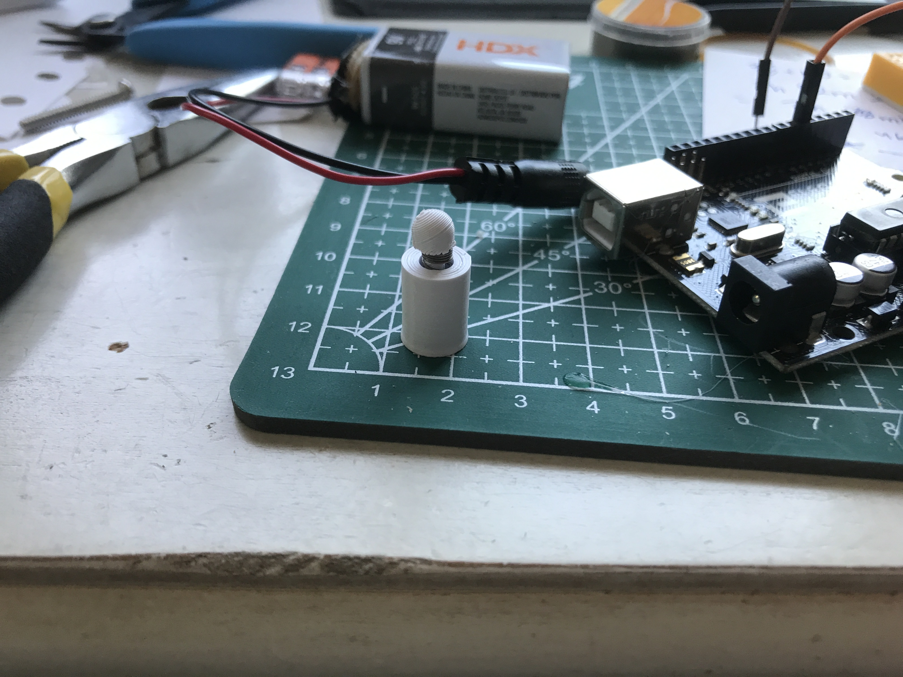
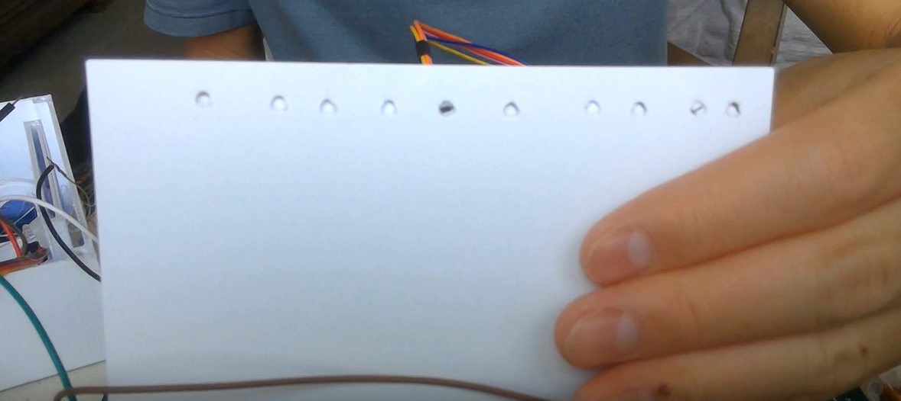
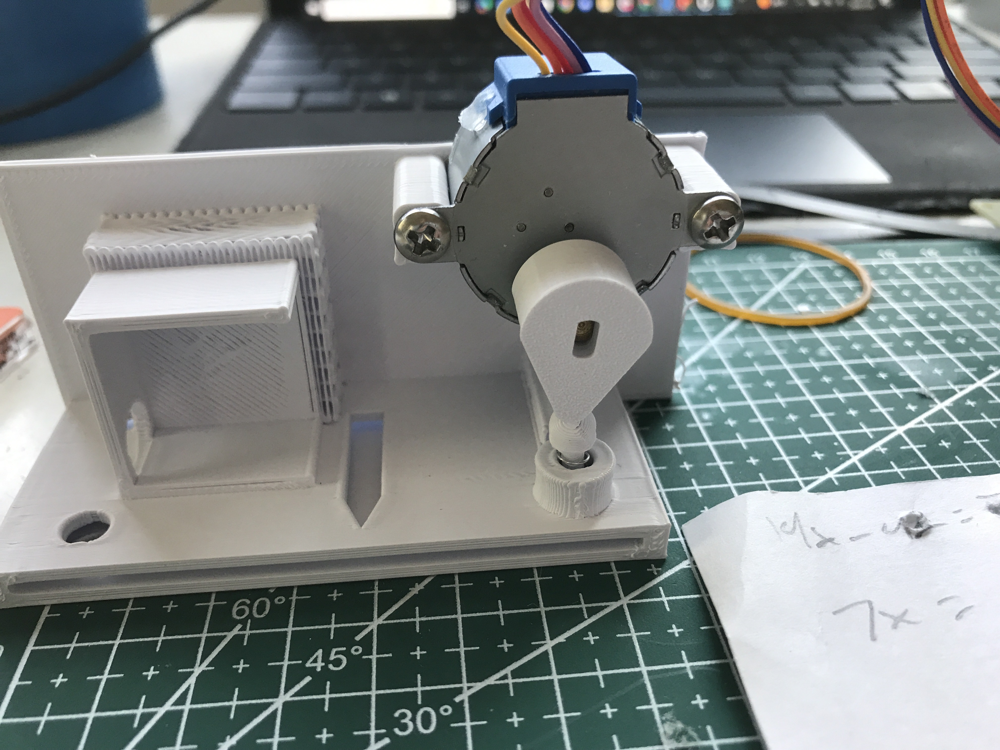

# Devlog 11
2h 3min Logged

Another long stretch of work! I may not need a Clock'n Lock'n after all ;) I mostly finished the cam system, added the final touches to the case's CAD, worked on the puncher, and did more coding in the Main file. I need to figure out a way to make a progress bar! It's my first time working with two OLED screens. 

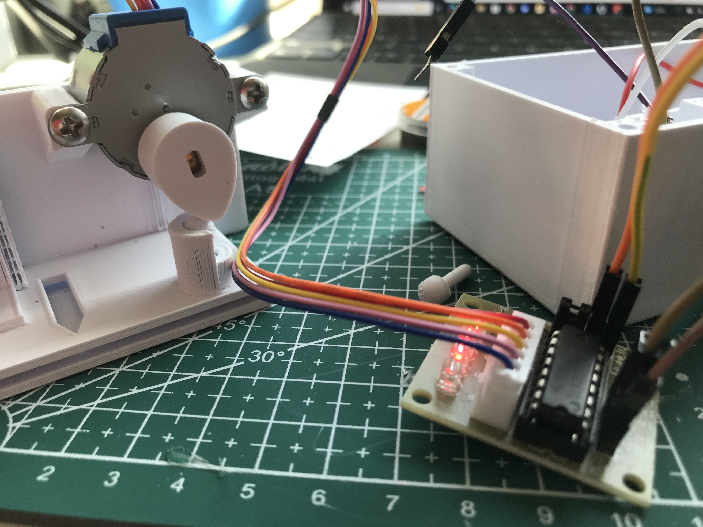

# Devlog 12

2h Logged

I diagnosed the puncher's issue as the cam gear pushing the pin down too fast. To slow the process down, I replaced the cam gear with a spiral gear. It distributes the 4mm push across the entire circumference. I also added supports beneath the paper chute to hold it up while the pusher pushes down. Though the punched hole is smaller than I intended, I am just glad that it works. 

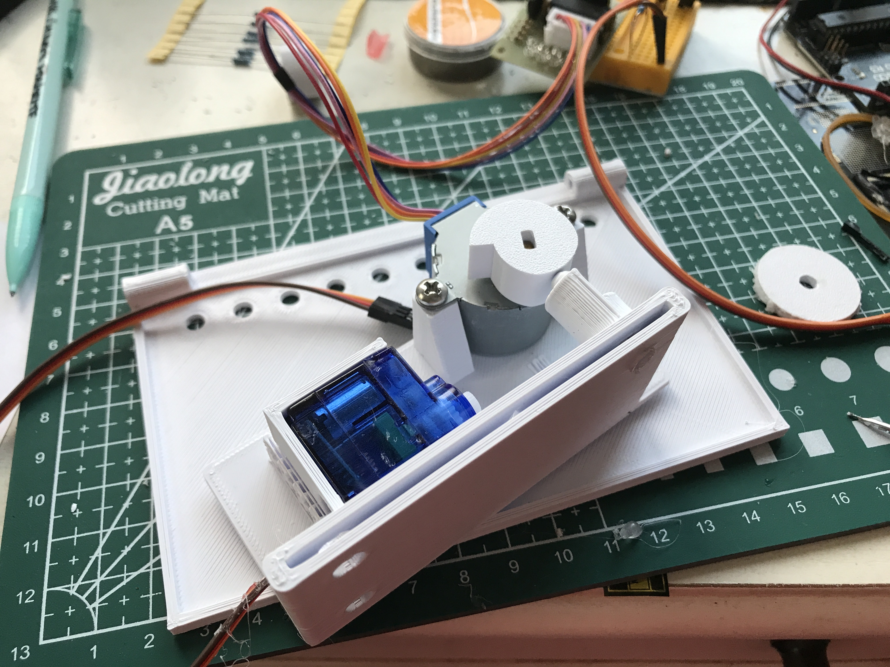

# Devlog 13
1h 55min Logged

I finished coding the Clock'n Lock'n! Well, at least the first complete version of it. I'll probably be back fixing bugs before I know it. I added the screen displays, the punching system, the movement system, and the positioning logic. I'm currently printing out all the parts of the Clock'n Lock'n, I can't wait to try the code out!

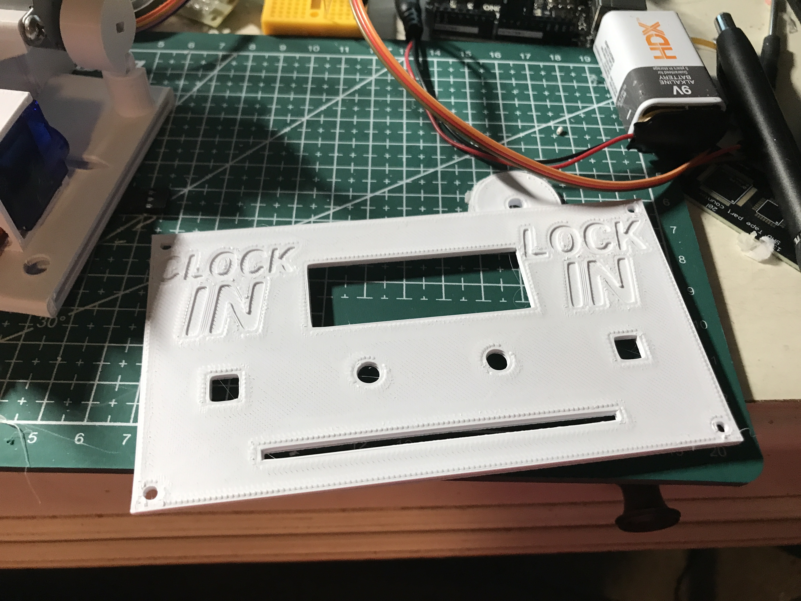

# Devlog 14
1h 2min Logged

I built part of the final Clock'n Lock'n! I got the LEDs and photoresistors soldered and glued in, along with both the servo motor and the stepper motor. I think I may finish it tomorrow! Here's a picture of the work thus far:

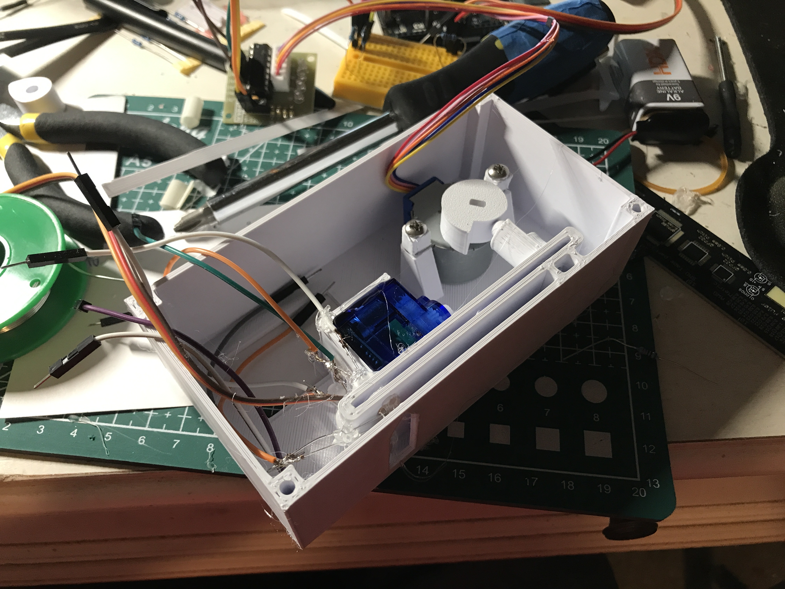

# Devlog 15
1h 47min Logged

I built most of the Clock'n Lock'n! I had to solder wires to the two remaining LEDs and the two buttons, and I had to do a bunch of wiring for all the parts. I decided to put the breadboard in the main chamber and the Arduino Uno R3 with the ULN2003 into the back chamber. Things are really cramped and sometimes it's hard to get wires where they need to go, but I'm managing. I still need to wire the OLEDs and the LEDs and buttons on the face. 

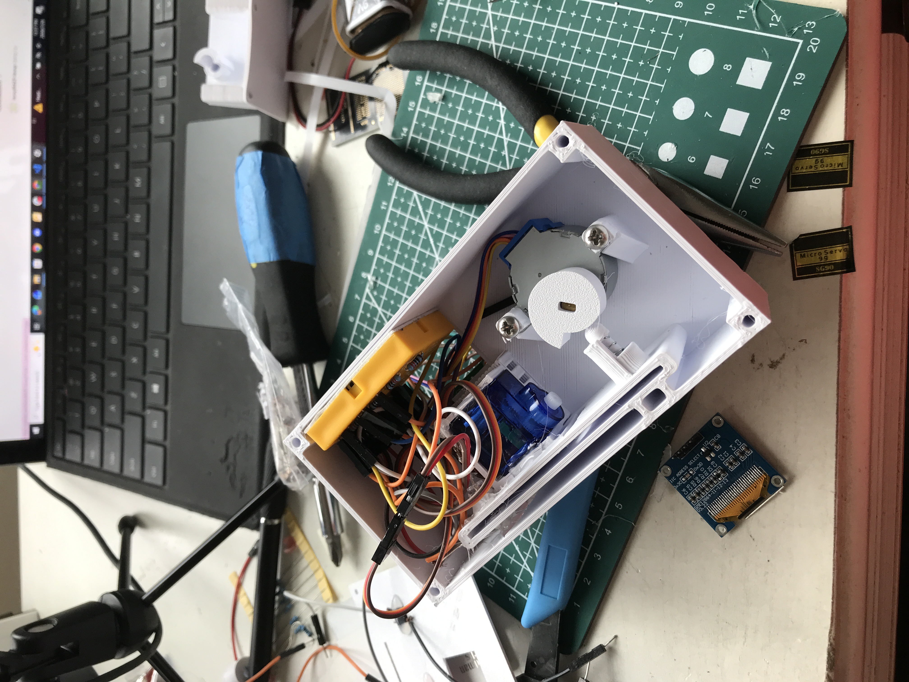
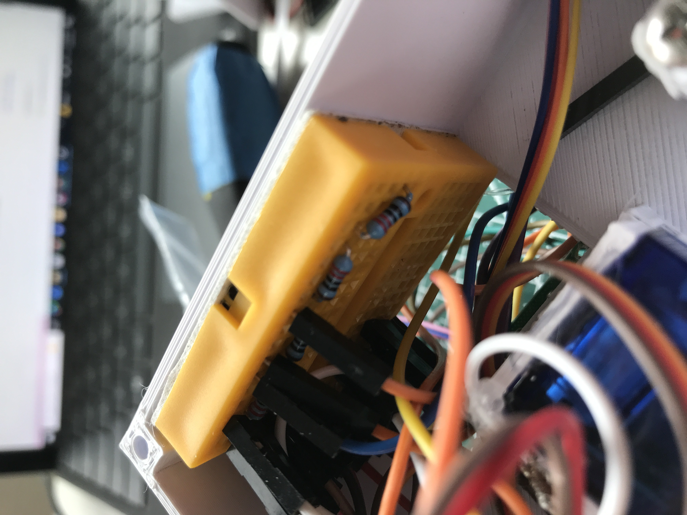
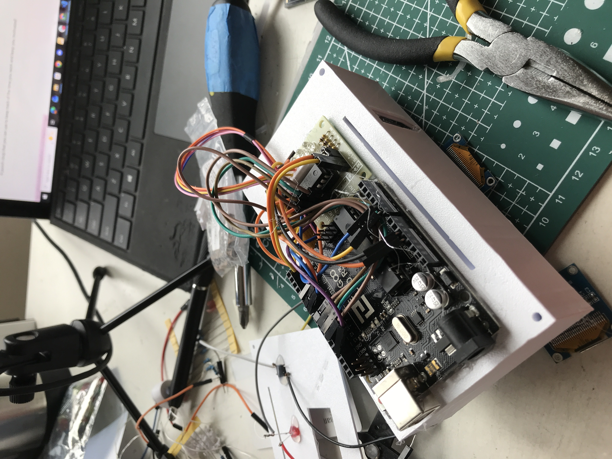

# Devlog 16
1h 26min Logged

I wired all of the components of the Clock'n Lock'n! It's almost fully built, even if I had to resolder some wires and reattach some jumpers. It's getting really sketchy, and when I tried putting the face on, it wouldn't fit! The same happened when I tried putting the back case on. To remedy this, I CADed a face and a back case which have taller walls. In the meantime, the Clock'n Lock'n is looking promising!

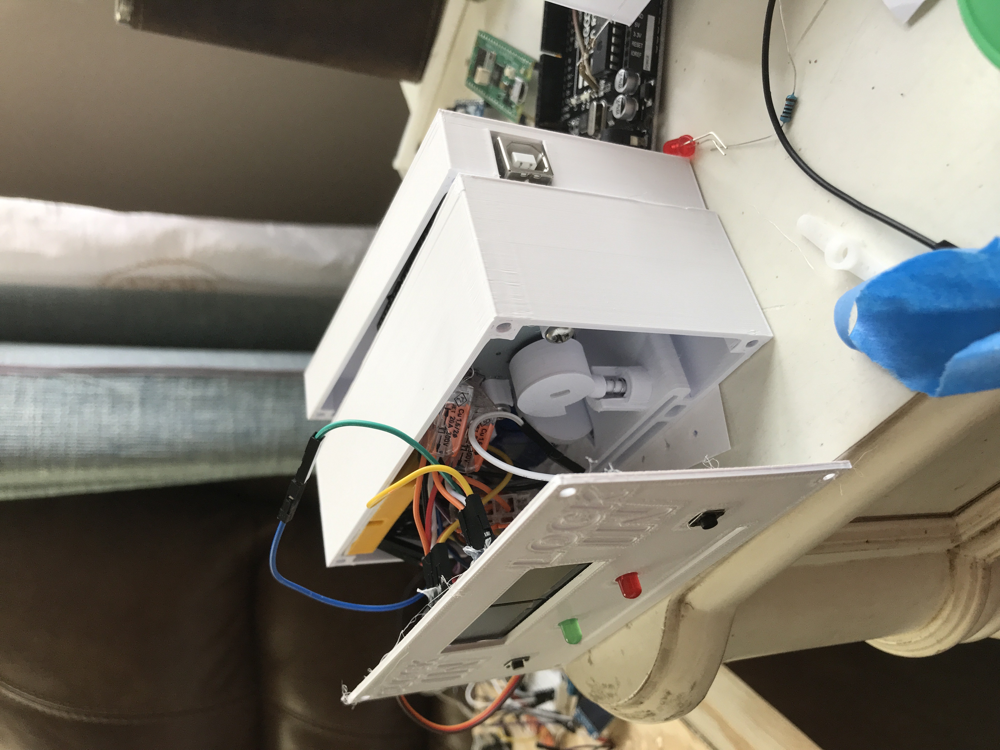
