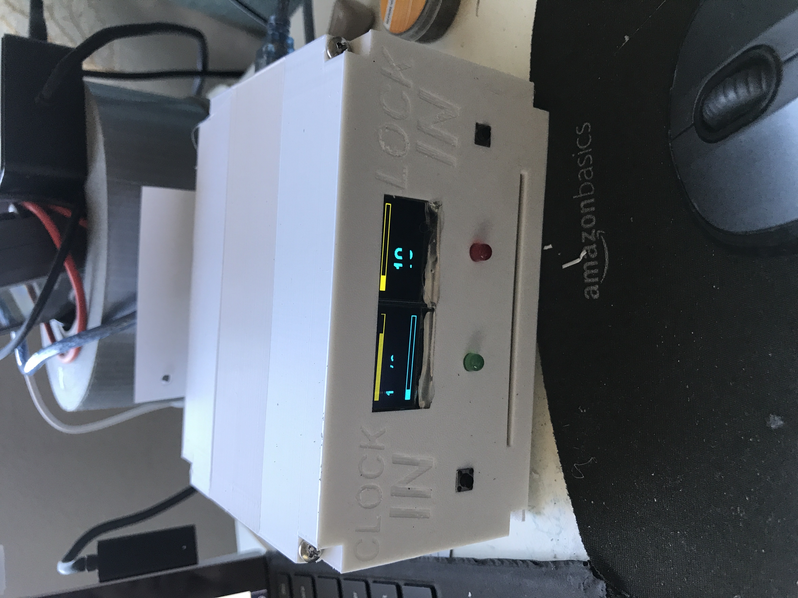

# Clock'n Lock'n
A punch clock that you can use to keep track of the time you work and keep you motivated!

I worked on this project to get myself to do more work! I guess that you gotta work to get work done ;)

Pros:

- Gives you a physical item as proof of your work!
- Motivates you to get your things done!
- Fun to make!

Cons:

- I KEEP ON WORKING IN TEN HOUR CHUNKS AND I CANT STOP PLEASE HELP ME

I hope that my repo helps you make your very own Clock'n Lock'n! Have fun! (P.S. I used OLEDs which is why the screen in the picture below is glitched out)

The following are instructions on how to build the Clock'n Lock'n for yourself:

# PARTS TO PRINT

Print all of the parts in the Parts to Print file!

- Case
- Back Case
- Face
- Spiral Gear
- Servo Gear
- Pin

The total cost will vary based on what type of filament you use, and how many times you mess up the prints :P

# PHYSICAL COMPONENTS

Here is everything you need to buy off Amazon, AliExpress, and Temu: 

- 2 5mm LEDs: $0.04
- 2 5mm Push Buttons: $0.50
- 2 128x64 OLEDS: $5.00
- 1 28BYJ-48 Stepper Motor plus ULN2003 Motor Driver: $5.00
- 1 SG90 Servo Motor: $1.20
- 1 Mini Breadboard: $1.25
- 1 Arduino Uno R3: $8.00
- 4 220 ohm Resistors: $0.20
- 2 1K ohm Resistors: $0.10
- 2 Photoresistors: $1
- 10 #6-32 1in Screws: $1.57
- Jumper Wires: Will Vary

In total, everything will run you around $23.86, definitely less than $30 (: 

# ASSEMBLY INSTRUCTIONS

Hot-glue the Arduino and the ULN2003 onto the back of the case. Hot glue the Servo motor onto its mount. Screw the 28BYJ-48 Stepper Motor onto its mount using two #6-32 screws. Attach the Servo Gear onto the Servo motor. Attach the Spiral Gear onto the Stepper motor. Put the pin in its slot with a pen's spring pushing it up. Hot glue all the LEDs, buttons, OLEDs, and photoresistors into place. Connect one leg of every LED and photoresistor to GND. Every LED's other leg goes to a 220 ohm resistor, then their digital pin (see in code). The photoresistors go to a 10k ohm resistor, then their analog pin (see code). Wire everything else as stated in code. Congrats, you have just built your very own Clock'n Lock'n!

# AI USE
AI was used to debug the code. 
